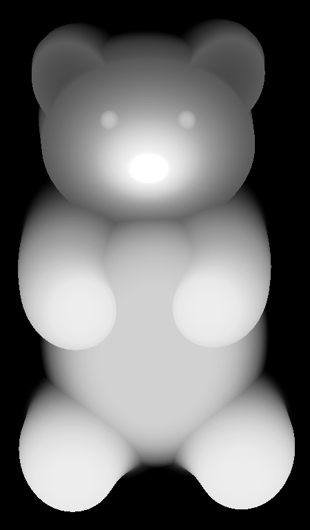
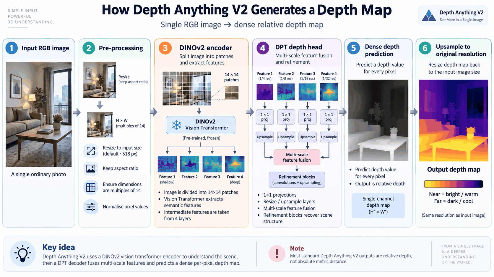

<div align="center">

# 🥽 StereoShift

### Turn any flat photo or video into 3D — entirely on your own device.

`2D in` → `AI depth` → `GPU stereo warp` → `Side-by-Side 3D out`

**iOS 17+ · SwiftUI · Core ML · Metal · 100% on-device · No servers, no uploads**

### 📲 [Download on the App Store](https://apps.apple.com/app/id6759077023)

Runs on **iPhone and Mac**.

</div>

---

## ▶️ Watch the intro

[](https://www.youtube.com/watch?v=jkezZdtaT8s)

> 🎬 **[Watch on YouTube →](https://www.youtube.com/watch?v=jkezZdtaT8s)** — a short walkthrough of the app and what the results look like.

---

## 📱 What it is

You give it an ordinary photo or video. It gives you back a **side-by-side 3D**
version you can watch in a VR headset, on a 3D display, or with cheap cardboard
glasses.

No cloud. No account. No upload. Everything happens on your device, in seconds.

| | Feature | Notes |
|:--:|:--|:--|
| 📷 | **Photo → 3D** | Any photo, any resolution, up to 12MP+ |
| 🎬 | **Video → 3D** | H.264 MP4, original audio kept |
| 🥽 | **Spatial media** | Splits Apple MV-HEVC spatial video into SBS |
| 🎚 | **3D Strength slider** | Subtle → Balanced → Strong, capped for viewing comfort |
| 🔒 | **Fully offline** | Nothing ever leaves the device |
| 📤 | **Share extension** | Send media straight from Photos into the app |
| 🌐 | **Web Share** | Serve results to a headset on the same Wi-Fi |
| 🌍 | **9 languages** | EN · ZH · JA · KO · ES · FR · PT-BR · HI · AR |

---

## 🎯 The whole idea, in one picture

```
      A normal 2D photo                    What StereoShift makes
   ┌────────────────────┐            ┌──────────┬──────────┐
   │                    │            │          │          │
   │      🌳    🏠      │    ──▶     │  🌳  🏠  │ 🌳   🏠  │
   │                    │            │          │          │
   └────────────────────┘            └──────────┴──────────┘
     one flat viewpoint                LEFT eye    RIGHT eye
                                     each object shifted by
                                       how far away it is
```

Your two eyes sit about 6.5 cm apart, so they never see quite the same picture.
Close things land in noticeably different places; distant things barely move.
Your brain reads that difference as **depth**.

So to fake 3D from a flat photo, we only need to answer one question — and then
act on it:

> **"How far away is every pixel?"**

---

## ⚙️ How 2D becomes 3D — the four moves

The whole conversion on one page:

<p align="center">
  
</p>

> 📌 That diagram is the **general** recipe for depth-based stereo conversion.
> StereoShift follows it up to the warp, then diverges at hole filling — it does
> not run an inpainting model. See step 4️⃣.

```
  ┌───────────┐    ┌───────────┐    ┌───────────┐    ┌───────────┐
  │  1. INPUT │    │ 2. DEPTH  │    │ 3. WARP   │    │ 4. OUTPUT │
  ├───────────┤    ├───────────┤    ├───────────┤    ├───────────┤
  │ 📷 photo  │───▶│ Core ML   │───▶│  Metal    │───▶│ 🖼 PNG    │
  │ 🎬 video  │    │ neural    │    │  compute  │    │ 🎞 MP4    │
  │ 🥽 spatial│    │ net       │    │  shaders  │    │  (L | R)  │
  └───────────┘    └───────────┘    └───────────┘    └───────────┘
                    "how far is        "move each
                     each pixel?"       pixel by
                                        its depth"
```

### 1️⃣ Guess the depth 🧠

A neural network looks at the flat image and outputs a **depth map** — a
greyscale picture where bright means near and dark means far. It has never
measured anything; it has simply seen enough photos to know that this shape,
at this size, with this blur, is probably close.

```
     the photo                 the depth map
   ┌────────────┐            ┌────────────┐
   │  🏠        │            │ ░░░░░      │   ░ far  (background)
   │      🌳    │    ──▶     │ ░░▓▓▓░     │   ▓ mid
   │   🧍       │            │ ███▓▓░     │   █ near (the person)
   └────────────┘            └────────────┘
```

A real one — a teddy bear, straight out of the model:

<p align="center">
  
</p>

Read it like a contour map. The **feet and belly are almost white** — they are
closest to the lens. The **ears and shoulders fade to grey** as the bear curves
away. The **background is pure black** — infinitely far. Even the nose picks up
a bright spot, because it sticks out.

That single greyscale image is all the geometry we get. Everything after this
step is just acting on it.

This runs on the **Neural Engine**, the chip Apple built for exactly this.

<details>
<summary>🔬 <b>What happens inside the model</b> (click to expand)</summary>

<br>

<p align="center">
  
</p>

The image is cut into **14×14 patches** and fed through a frozen DINOv2 vision
transformer, which is why input dimensions must be multiples of 14. Features are
taken from four different depths of the network — shallow ones carry edges and
texture, deep ones carry scene layout — and a DPT head fuses all four scales into
one depth value per pixel.

The output is **relative** depth, not metres. It tells you what is nearer than
what, and nothing about absolute distance.

</details>

### 2️⃣ Sharpen the depth map ✂️

The model works at roughly 518 px, so its depth map is small and blurry — its
edges don't line up with the real edges in your photo. Warping with a sloppy
depth map produces a visible halo around people.

So the depth map is re-sharpened **using the colour image as a guide**: where
the photo has a hard edge, the depth is forced to have one too.

```
   blurry depth edge          guided by colour           snapped depth edge
     ▓▓▒▒░░░░                  │ real edge │                 ▓▓▓│░░░
     ▓▓▒▒░░░░        +         │  is here  │      ──▶        ▓▓▓│░░░
     ▓▓▒▒░░░░                  │           │                 ▓▓▓│░░░
```

### 3️⃣ Shift every pixel by its depth ↔️

Now build two images: one for the left eye, one for the right. Each pixel slides
sideways by an amount taken straight from its depth.

```
                       LEFT eye        RIGHT eye
   near  █████████      → → →            ← ← ←        big shift
   mid   ▓▓▓▓▓▓▓▓▓       → →              ← ←         some shift
   far   ░░░░░░░░░        ·                ·          no shift
                     ────────────────────────────
                        the "screen plane"
```

Anything nearer than the screen plane pops **out** of the screen; anything
further recedes **behind** it. The plane sits at the scene's middle depth, so
the picture straddles the screen instead of floating awkwardly in front of it.

The `3D Strength` slider is the one knob you touch: it scales how far pixels are
allowed to move — **Subtle → Balanced → Strong**. It does not change the depth map;
the AI's guess about what is near and far stays identical. Only the size of the
shift changes.

That shift is capped at **2.5% of the frame width**. Past roughly that point your
eyes have to diverge uncomfortably to fuse the image, which is what makes bad 3D
give people headaches. The cap holds even at maximum strength.

### 4️⃣ Fill the gaps and stitch 🩹

Shifting a foreground object sideways uncovers background that was never
photographed — a hole. StereoShift fills these while warping: for each output
pixel it **scans** across possible source pixels, nearest-first. Two useful
things fall out of that scan order for free:

- 🥇 When several pixels compete for the same spot, the **nearest one wins** — which is exactly what real occlusion does.
- 🩹 Inside a hole, the scan runs past the object's edge onto the background and **stretches it across the gap** — no separate repair pass needed.

Finally the two eye images are copied into one double-width frame:

```
   ┌──────────┬──────────┐
   │   LEFT   │  RIGHT   │   ← this is the file you get
   └──────────┴──────────┘
```

For **video**, all of this repeats per frame, with the depth scale smoothed
across frames so the 3D doesn't pulse. Audio is carried through untouched.

---

## 🧭 An honest limitation: shifting is not rotating

A question worth answering before someone in the audience asks it.

With a **real** stereo camera, the two lenses sit in different places, so each one
sees the object from a slightly different angle — the left lens catches a little
more of the object's left side. The object has not turned; the *viewpoint* moved.

```
        the object                    two real cameras
       ┌──────┐                    (different viewpoints)
      /      /│
     /______/ │              👁 ────────────────── 👁
     │      │ │            left                 right
     │      │/          sees more of          sees more of
     └──────┘            its left side         its right side
```

StereoShift does **not** do that. It slides pixels sideways. No surface ever
turns to face you differently. There are two levels of quality here, and it is
worth being upfront about which one this is:

| | Approach | What it does | Cost |
|:--|:--|:--|:--|
| ✅ | **Pixel shifting** *(what this app does)* | Slide pixels horizontally by their depth | Real-time, on-device, offline |
| 🔬 | **True 3D reprojection** | Lift pixels into 3D points, move a virtual camera, project back | Heavier, more correct perspective |

But even proper reprojection hits a wall with a single photo, and this is the
part that cannot be engineered away:

```
   the camera saw this           move the viewpoint right →
     ┌───────┐                     ┌───────┐\
     │ FRONT │                     │       │ \
     │       │                     │       │  \  ← this side was never
     └───────┘                     └───────┘___\    photographed
```

The depth map knows *"there is a surface here in 3D"*. It has no idea *"this is
what the hidden side looks like"* — because that information was never in the
photo. Systems that chase maximum quality bolt an AI inpainting or novel-view
model onto the end to invent those pixels. StereoShift deliberately does not:
that would cost a model load, a lot of time per frame, and it would hallucinate.

### 👻 So that's where ghost edges come from

Every visible artefact in depth-based stereo traces back to this same root — the
photo simply does not contain what the second eye needs to see:

| Artefact | Cause | What StereoShift does about it |
|:--|:--|:--|
| 🕳 **Holes / gaps** | Shifting the foreground uncovers background that was never captured | The scanline warp runs past the silhouette and stretches real background across the gap |
| 👻 **Ghost / double edges** | Foreground and background pixels compete for the same output pixel | Scanning nearest-first means the foreground always wins |
| ✂️ **Halos around hair, fingers, glasses** | Depth boundaries are slightly wrong on thin detail, so neighbours shift by different amounts | RGB-guided refine snaps depth edges to image edges |
| 🌫 **Soft or duplicated edges** | Sub-pixel shifting and resampling smear the boundary | Directional dilate plus a sub-pixel refinement sample |

Which is the point of the whole GPU pipeline below: **each pass exists to kill one
of those four artefacts.** None of them is decoration.

---

## 🎮 Under the hood: one GPU pass

Moves 2–4 above are five Metal compute kernels, dispatched in a **single command
buffer**, running on the raw model output — never quantised to 8-bit, never
upscaled on the CPU.

```
   RGB frame ──────────────────────────────┐
                                           ▼
   depth (518px, blurry)  ──▶  ① REFINE  ──▶ crisp full-res depth
                                 edge-aware upscale + normalise
                                           │
                                           ├─────────────┬─────────────┐
                                           ▼             ▼             │
                                     ② DILATE      ② DILATE           │
                                     (left eye)    (right eye)         │
                                           │             │             │
                                           ▼             ▼             │
                                     ③ FEATHER     ③ FEATHER          │
                                           │             │             │
                                           ▼             ▼             │
                                     ④ WARP ◀──────────────────────────┘
                                     left        right
                                           │             │
                                           └──────┬──────┘
                                                  ▼
                                            ⑤ COMPOSE
                                           ┌──────┬──────┐
                                           │  L   │  R   │  ← double-width output
                                           └──────┴──────┘
```

| # | Pass | Job |
|:--:|:--|:--|
| ① | **Depth Refine** | RGB-guided bilateral filter: crop, upsample and snap depth edges to image edges, all in one step |
| ② | **Directional Dilate** | Grows near-depth across a silhouette's fuzzy band, only toward the side where that eye's hole opens |
| ③ | **Feather** | Light Gaussian (σ ≈ 1.2 px) so the warp lands smoothly instead of on hard steps |
| ④ | **Stereo Warp** | The occlusion-ordered scanline search described above, per eye |
| ⑤ | **Compose SBS** | Copies both eyes into one double-width texture |

<details>
<summary><b>A few implementation notes</b></summary>

<br>

- `CVPixelBuffer ↔ MTLTexture` via `CVMetalTextureCache` — zero-copy GPU access.
- Maximum shift is `baselinePerEye × Strength × (width / 1440)`, capped at **2.5%** of frame width for viewing comfort. Scaling by width means every resolution gets the same *perceived* depth.
- Depth is normalised with 2% / 98% percentile bounds, so one bright outlier can't eat the disparity budget.
- Behind-screen disparity tapers to zero near the left/right borders to avoid edge smearing.
- CPU and CIKernel renderers are kept as fallbacks if Metal is unavailable.

</details>

---

## 🧰 Tech stack

| Layer | Technology |
|:--|:--|
| 🖼 UI | Swift + SwiftUI (iOS 17+) |
| 🧠 Depth AI | Core ML — `Depth Anything V2 Small F16` |
| 🎮 Rendering | Metal compute shaders — Apple's direct pipe to the GPU, so all 12 million pixels move at once instead of one after another |
| 🎞 Media I/O | AVFoundation reader / writer |

```
StereoShift/
├── App/        🚀  entry point, theme, language
├── UI/         🎨  Home · Photo flow · Video flow · Gallery
├── Core/       ⚙️  the whole conversion pipeline
│   ├── DepthEstimator.swift        🧠 Core ML depth
│   ├── StereoRenderer.swift        🧭 engine routing + depth stats
│   ├── MetalStereoRenderer.swift   🎮 GPU pipeline manager
│   ├── StereoShaders.metal         ✨ the compute kernels
│   ├── VideoProcessor.swift        🎬 frame-by-frame video path
│   └── SpatialMediaConverter.swift 🥽 MV-HEVC → SBS
└── Resources/  📦  DepthAnythingV2SmallF16.mlpackage
```

---

## 🚀 Getting started

```bash
# 1 · Fetch the depth model
./scripts/download_depth_anything_v2.sh

# 2 · Open the project
open StereoShift.xcodeproj
```

**3** · Pick an iOS 17+ device or simulator → **Run** ▶️
**4** · Choose a photo or video → drag **3D Strength** → tap **Generate** ✨

```bash
# Build (no signing needed)
xcodebuild -project StereoShift.xcodeproj -scheme StereoShift \
  -destination 'generic/platform=iOS Simulator' -configuration Debug build \
  CODE_SIGNING_ALLOWED=NO
```

---

<div align="center">

**Built with Swift, Metal and a lot of staring at edge artefacts.** 🥽

</div>
